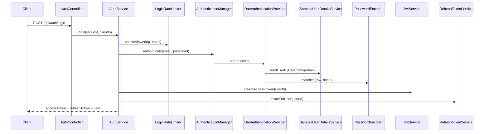

# Samosa Junction — Security Architecture

<!-- AI-ASSISTED: Cursor -->
<!-- PROMPT: Document production-grade Spring Security architecture -->
<!-- ACCEPTED-BY: omprakash -->

This document describes authentication, authorization, and security decisions for the backend API.

## Overview

The API is **stateless**. Clients authenticate with a **short-lived JWT access token** (`Authorization: Bearer …`) and renew sessions using an **opaque refresh token** stored server-side as a SHA-256 hash.

Spring Security concepts in use:

| Concept | Implementation |
|---------|----------------|
| `SecurityFilterChain` | `SecurityConfig` — URL rules, CORS, headers, CSRF policy |
| `JwtAuthenticationFilter` | Bearer JWT → `SecurityContext` |
| `AuthenticationManager` | Password login via `AuthService` |
| `AuthenticationProvider` | `DaoAuthenticationProvider` |
| `UserDetailsService` | `SamosaUserDetailsService` |
| `UserDetails` | `UserPrincipal` |
| `PasswordEncoder` | `BCryptPasswordEncoder` |
| `@PreAuthorize` | Staff/kitchen controllers (defense-in-depth) |

---

## 1. Login Flow



**Why `AuthenticationManager`?** Login delegates credential verification to Spring Security's standard pipeline. `UserDetailsService` loads the user; `PasswordEncoder` verifies the hash; disabled accounts throw `DisabledException`. `AuthService` remains the orchestration layer and maps failures to a generic `"Invalid email or password"` message.

---

## 2. Registration Flow

`POST /api/auth/register` — public.

1. Normalize email, reject duplicates.
2. Hash password with BCrypt.
3. Assign `CUSTOMER` role, create wallet.
4. Issue access + refresh tokens (same response shape as login).

---

## 3. JWT Access Tokens

**Algorithm:** HS256 (HMAC-SHA256) via jjwt 0.12.6  
**Secret:** `JWT_SECRET` env var (minimum 32 bytes). Production startup fails if the dev default is used (`spring.profiles.active=prod`).

| Claim | Purpose |
|-------|---------|
| `sub` | User UUID — sole identity claim |
| `iss` | Issuer — validated on parse (`JWT_ISSUER`) |
| `aud` | Audience — validated on parse (`JWT_AUDIENCE`) |
| `iat` / `exp` | Lifetime — default **15 minutes** (`JWT_EXPIRATION`) |

**Excluded from JWT:** roles, email, passwords, PII. Roles are loaded from the database on each request so role changes take effect immediately.

**Clock skew:** 60 seconds (`JWT_CLOCK_SKEW`) tolerates minor clock drift between services.

---

## 4. JWT Validation (Filter)

`JwtAuthenticationFilter` runs before `UsernamePasswordAuthenticationFilter`:

1. Read `Authorization` header; require `Bearer` scheme.
2. Parse and validate JWT via `JwtService` (signature, iss, aud, exp).
3. Load user + roles from DB; reject disabled users.
4. Build `UserPrincipal.forAuthenticatedUser(user)` — **no password hash** in context.
5. Set `Authentication` on `SecurityContextHolder`.
6. Invalid tokens: clear context, continue chain (protected endpoints → 401).

---

## 5. Refresh Tokens

**Design:** Opaque random tokens (256-bit), **never stored raw**. Only SHA-256 hashes persist in `refresh_tokens`.

| Field | Purpose |
|-------|---------|
| `token_hash` | SHA-256 of raw token (unique) |
| `expires_at` | Default 7 days (`AUTH_REFRESH_TOKEN_TTL`) |
| `revoked_at` | Logout, rotation, or reuse detection |
| `replaced_by_token_id` | Links rotated token chain |

**Endpoints:**

- `POST /api/auth/refresh` — rotate refresh token, issue new access token.
- `POST /api/auth/logout` — revoke presented refresh token.

**Rotation:** Each refresh invalidates the old token and issues a new one.

**Reuse detection:** Presenting an already-revoked refresh token revokes **all** active refresh tokens for that user (stolen-token scenario).

**Revocation triggers:** logout, password reset, reuse detection.

---

## 6. Roles vs Authorities

| DB Role | Spring Authority | `hasRole("X")` | `hasAuthority("X")` |
|---------|------------------|----------------|---------------------|
| `ADMIN` | `ROLE_ADMIN` | `hasRole("ADMIN")` | `hasAuthority("ROLE_ADMIN")` |
| `STAFF` | `ROLE_STAFF` | `hasRole("STAFF")` | `hasAuthority("ROLE_STAFF")` |
| `CUSTOMER` | `ROLE_CUSTOMER` | `hasRole("CUSTOMER")` | `hasAuthority("ROLE_CUSTOMER")` |

`hasRole("ADMIN")` automatically prefixes `ROLE_`. Authorities come from the database only — never from client input.

---

## 7. Authorization

**Layer 1 — URL matchers (`SecurityConfig`):**

| Access | Examples |
|--------|----------|
| Public | `/api/auth/*`, catalog GET, `/actuator/health` |
| STAFF/ADMIN | product mutations, inventory PUT, complaint PATCH, `/api/staff/**` |
| Authenticated | orders, cart, wallet, profile |

**Layer 2 — `@PreAuthorize`:** `StaffController`, `KitchenController`.

**Layer 3 — Service ownership:** orders, payments, complaints verify `userId` or `isPrivileged()`.

---

## 8. 401 vs 403

| Status | Meaning | Handler |
|--------|---------|---------|
| **401** | Missing/invalid authentication | `JsonAuthenticationEntryPoint` |
| **403** | Authenticated but not authorized | `JsonAccessDeniedHandler` |

Errors use `ApiError` JSON — no stack traces, JWT internals, or credential details.

---

## 9. Password Reset

1. `POST /api/auth/forgot-password` — generic response (no email enumeration).
2. Invalidates prior active reset tokens for the user.
3. Opaque token emailed; SHA-256 hash stored; 30-minute TTL.
4. `POST /api/auth/reset-password` — single-use; revokes all refresh tokens.

Production: `AUTH_EXPOSE_RESET_PATH=false` (no reset URL in API response).

---

## 10. Account Security

**Login rate limiting (Redis):** Tracks failures per IP and per email. Default: 10 attempts / 15-minute lockout (`AUTH_MAX_LOGIN_ATTEMPTS`, `AUTH_LOGIN_LOCKOUT_DURATION`).

**Audit logging:** Structured logs for login success/failure, password reset, refresh rotation, reuse detection, rate limiting. Never logs passwords, tokens, or Authorization headers.

---

## 11. CORS

Configured origins from `CORS_ALLOWED_ORIGINS` — never `*` with credentials. Applies to `/api/**` only.

**CORS is not authentication.** It controls browser cross-origin access only; the API still requires JWT for protected resources.

---

## 12. CSRF

**Disabled** — correct for Bearer-token APIs. Browsers do not automatically attach `Authorization` headers on cross-origin requests.

**Revisit if:** refresh tokens move to `HttpOnly` cookies → enable CSRF + `SameSite=Strict`.

---

## 13. Security Headers

Enabled in `SecurityConfig`:

- `X-Content-Type-Options: nosniff`
- `X-Frame-Options: DENY`
- `Referrer-Policy: strict-origin-when-cross-origin`
- `Strict-Transport-Security` (on HTTPS connections)

---

## 14. Secret Management

| Secret | Source |
|--------|--------|
| `JWT_SECRET` | Environment / secret manager |
| `DB_PASSWORD` | Environment |
| `JWT_ISSUER`, `JWT_AUDIENCE` | Environment (non-secret but configurable) |

Never commit production secrets. Dev defaults exist for local/docker only.

**Production profile:** `spring.profiles.active=prod` enables stricter defaults and blocks the dev JWT secret.

---

## 15. Configuration Reference

```yaml
samosa:
  jwt:
    secret: ${JWT_SECRET}           # required in prod, ≥32 bytes
    expiration: ${JWT_EXPIRATION:15m}
    issuer: ${JWT_ISSUER:samosa-junction}
    audience: ${JWT_AUDIENCE:samosa-junction-api}
    clock-skew: ${JWT_CLOCK_SKEW:60s}
  auth:
    refresh-token-ttl: ${AUTH_REFRESH_TOKEN_TTL:7d}
    max-login-attempts: ${AUTH_MAX_LOGIN_ATTEMPTS:10}
    login-lockout-duration: ${AUTH_LOGIN_LOCKOUT_DURATION:15m}
    expose-reset-path: ${AUTH_EXPOSE_RESET_PATH:true}  # false in prod
```

---

## 16. Interview Summary

> "We use stateless JWT access tokens for API authentication, but refresh tokens are opaque and stored as hashes so we can revoke sessions. Login goes through Spring Security's `AuthenticationManager` so credential checks use the standard `UserDetailsService` + `PasswordEncoder` pipeline. Roles live in the database, not the JWT, so authorization changes are immediate. CSRF is off because we use Bearer tokens, not cookies. Defense-in-depth: URL rules, method security, and service-layer ownership checks."
