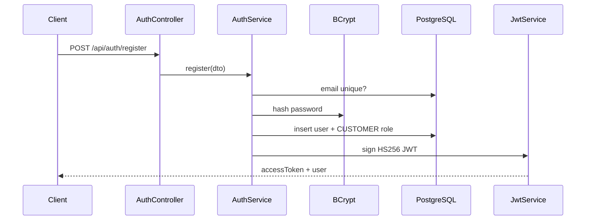

# Authentication

## Problem

Public HTTP APIs cannot trust the caller. We need to know *who* the user is (authentication) and *what they are allowed to do* (authorization) without storing server-side sessions.

## Flow



Login is the same except we `matches()` the hash instead of inserting a row.

Authenticated calls:

```text
Authorization: Bearer <jwt>
        ↓
JwtAuthenticationFilter  (parse + signature + expiry)
        ↓
Load User by id (enabled? roles?)
        ↓
SecurityContext  (UserPrincipal)
        ↓
Controller  (@AuthenticationPrincipal)
```

Java remains the source of truth. The token is a signed claim that the user logged in; disabling the account in PostgreSQL still blocks the next request because the filter reloads the user.

## Why JWT (stateless)

The API does not keep a session in Redis/memory. Any instance can verify the signature with the same secret. That matches a future ECS/EC2 horizontal scale-out.

Trade-off: you cannot instantly revoke a token unless you add a denylist or short TTL. We mitigate by loading `enabled` from the database on each request. We are **not** claiming a full token-revocation system yet.

## Why BCrypt

Passwords must never be stored in plaintext. BCrypt is a slow, salted one-way hash. Even if the `users` table leaks, an attacker still has to brute-force hashes. BCrypt only uses the first 72 bytes of the password — that is why registration caps length at 72.

## SecurityFilterChain

- CSRF is disabled: browsers send cookies automatically (CSRF target). We use `Authorization` headers, not cookie sessions.
- Session policy is `STATELESS`.
- `POST /api/auth/register` and `/login` are public.
- `/actuator/health` and `/info` are public so local/load-balancer checks work. Tighten this before production.
- Everything else requires authentication.

Roles are stored as `ROLE_CUSTOMER`, `ROLE_STAFF`, `ROLE_ADMIN` so `@PreAuthorize("hasRole('ADMIN')")` works later. No admin-only APIs exist yet.

## ID strategy (users)

`users.id` is a UUID generated by Hibernate. We do **not** expose auto-increment user ids in JWTs, so a client cannot guess the next user.

| | UUID | BIGINT identity |
| --- | --- | --- |
| Guessable | No | Yes (enumerable) |
| Index size | Larger | Smaller |
| Sort by insert time | Random UUID is not ordered | Natural |
| DB joins | Slightly heavier | Cheaper |

Roles use `BIGSERIAL` because there are three rows and they are not public identifiers.

## What we did not build yet

Refresh tokens, email verification, OAuth2, a **full address book**, or login rate limiting.

**Password reset is live** (`POST /api/auth/forgot-password` and `reset-password`). Locally the JSON may include `resetPath` because there is **no SMTP**. That is demo-only.

## Next kitchen: real email / SMS

Send the reset link by email (or OTP by SMS). Never return `resetPath` or the raw token in production JSON. Store hashed tokens (already the direction in `password_reset_tokens`). Add login rate limiting when brute-force is a real concern.

Profile holds **one** default delivery + phone (`PATCH /api/users/me`). Multiple saved homes is leftover — see [learning.md](learning.md).
